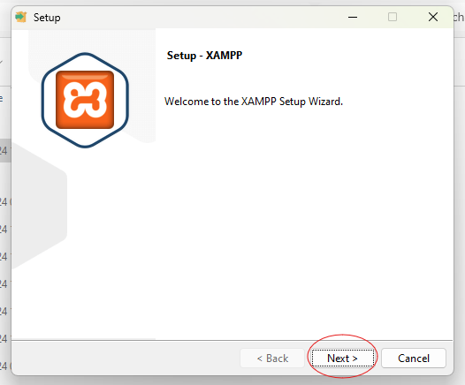
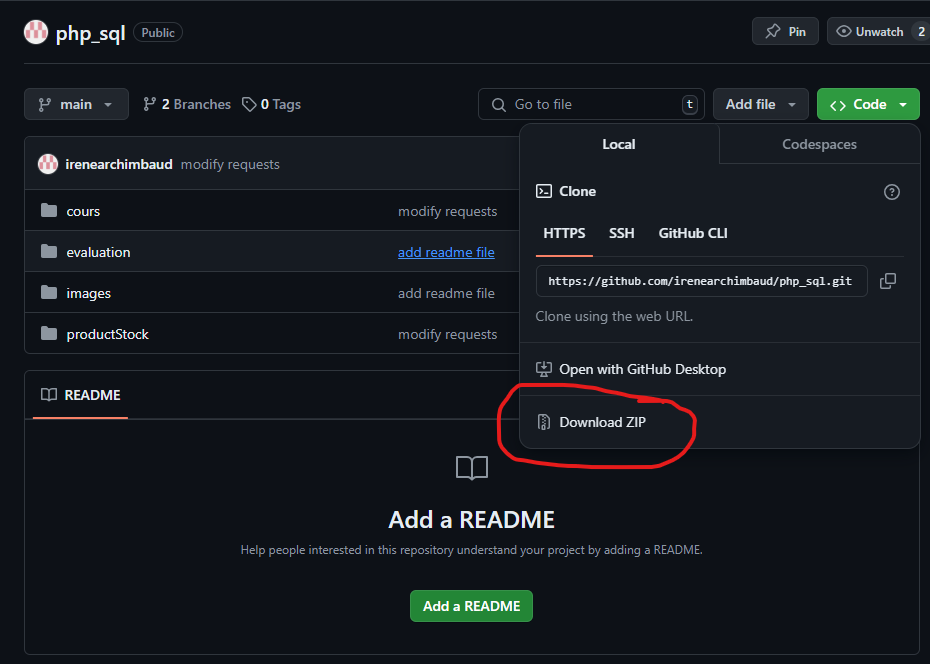
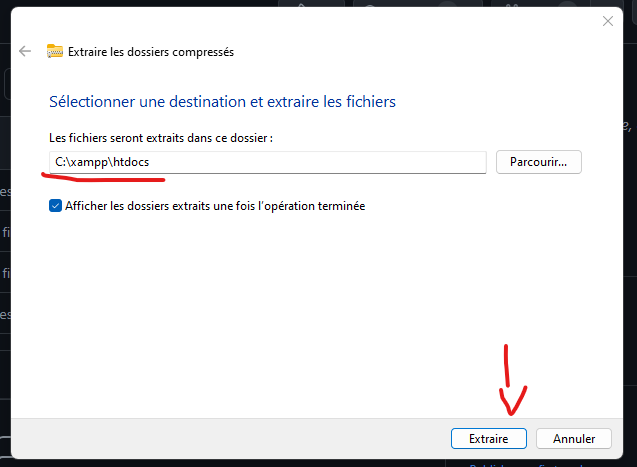
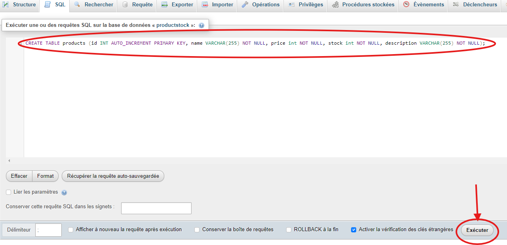

# Description de ProductStock

le dépot GIT de productStock est le suivant: https://github.com/irenearchimbaud/php_sql

ProductStock est une application WEB de gestion des stocks de produits. L'application permet la gestion des stocks, la mise a jour de ceux-ci, leur suppression ainsi que l'ajout de nouveaux produits pouur la vente.

L'interface promet également à l'avenir une visualisation en direct des statistiques de vente ainsi que des stocks pour que l'accessibilité des données soient visibles et plus accessible via une interface WEB facile d'utilisation et simple.

## Structure:

- `cours:` Les prises de notes pendant les cours, et les exercices réalisés
- `evaluations:` Les réponses des évaluations effectuées
- `images:` Les images utilisées au sein du projet
- `productStock:` Le dossier dans lequel se trouve le code de mon application WEB <b>ProductStock</b>
- `doc.md:` La documentation liée a la mise en production d'une application WEB grace à Oracle et apache, GIT, ainsi que les détails de la procédure de ma mise en production
- `README.md:` La documentation pour lancer le projet en local, et le détail de la structure de mon projet 

# Comment lancer l'application ?

## Prérequis

Pour pouvoir lancer le projet il est nécéssaire de disposer de XAMPP afin d'avoir l'accès à un serveur apache, et mySQL.

Pour installer XAMPP, il suffit de se rendre sur le site officiel:

https://www.apachefriends.org/fr/

Et de télécharger le lien adéquat en fonction de votre OS.


Cliquez ensuite sur le fichier .exe ou sur le telechargement pour démarrer l'installation.

Cette popup devrait s'afficher:



Cliquez sur "Next" jusqu'a ce que l'installation débute:


## Mise en place du projet:

Une fois l'installation de Xampp terminée, nous pouvons passer à la mise en place du projet en local.

Pour ce faire, il faut télécharger le fichier zipp du projet depuis le dépot gitHub



Une fois téléchargé, extrayez le dossier dans `C:\xampp\htdocs`. (Dans le dossier htdocs de xampp)



### Base de données MariaDB

Pour mettre en place la base de données, démarrez Apache et MySQL depuis XAMPP :


Il est maintenant possible d'accéder à PHPMyAdmin pour accéder aux bases de données depuis le navigateur web avec l'adresse [http://localhost/phpmyadmin/](http://localhost/phpmyadmin/)

Pour créer la base de données, cliquez sur "Nouvelle base de données", donnez-lui un nom, dans notre cas `productStock`, puis cliquez sur "Créer".


### Création des tables

Pour que la base de données corresponde aux requêtes effectuées dans le projet, il va falloir créer nos tables dans notre base de données.

Pour ce faire, nous allons cliquer sur la base de données que l'on vient de créer: `productStock`, puis on va se rendre dans l'onglet SQL en haut.


Entrez les requêtes SQL suivantes puis exécutez-les :

```sql
CREATE TABLE users (id INT AUTO_INCREMENT PRIMARY KEY, username VARCHAR(255) NOT NULL, password VARCHAR(255) NOT NULL, email VARCHAR(255) NOT NULL);

CREATE TABLE products (id INT AUTO_INCREMENT PRIMARY KEY, name VARCHAR(255) NOT NULL, price int NOT NULL, stock int NOT NULL, description VARCHAR(255) NOT NULL);
```



## Structure de la base de données

### Tables et évolutions

#### products
La table `products` permet de stocker tous les médicaments en stock (ou non) avec ses informations correspondantes (stock, prix, nom, description).

#### users
La table `users` contient toutes les informations des utilisateurs (username, email, password haché) afin de pouvoir se connecter a son compte utilisateur.

## Fonctionnalités de ProductStock

### Sécurité

Pour hacher les mot de passe en base de données, j'utilise  la fonction password_hash() de php lors de l'envoie des données en base de données.

```php
if($password === $confirmPassword) {
        $password = password_hash($_POST['confirmPassword'], PASSWORD_DEFAULT);
        $sql = 'INSERT INTO users (`email`, `password`, `username`) VALUES (:email, :password, :username)';
        $stmt = $pdo->prepare($sql);
        $stmt->execute(['email' => $email, 'password' => $password, 'username' => $username]);

        echo "Inscription réussie";
        header('Location: connexion.php');
        exit();
    }
```

Dans ce code, j'envoie les données en base de données uniquement SI le mot de passe correspond à la saisie de l'input de confirmation de mot de passe.

# Lancement en local

pour que le projet soit fonctionnel en local, il est nécéssaire de modifier le PDO dans le fichier `env.php`.

Il faudra modifier les variables `$user` et `$pass` comme effectué ci dessous:

```php
    $user = "root";
    $pass = "";
```


# Injection SQL

Pour éviter le risque d'injection SQL, PDO utilise les requêtes préparées via la fonction prepare().

```php
if(isset($_POST['name']) && isset($_POST['price']) && isset($_POST['stock']) && isset($_POST['description'])) {
        $name = htmlspecialchars($_POST['name']);
        $price = htmlspecialchars($_POST['price']);
        $stock = htmlspecialchars($_POST['stock']);
        $description = htmlspecialchars($_POST['description']);
    
            $sql = "INSERT INTO `products`(`name`, `price`, `stock`, `description`) VALUES (:name, :price, :stock, :description)";
            $stmt = $pdo->prepare($sql);
            $stmt->execute(['name' => $name, 'price' => $price, 'stock' => $stock, 'description' => $description]);
            $product = $stmt->fetchAll();
    
            header('Location: stock.php');
            exit();
    }

```

On utilise aussi htmlspecialchars lors de la récupération des données ce qui empêche que les charactères spéciaux soient interprétés afin que si un hacker essaie d'entrer du code html, ou des requêtes SQL, cela ne soit pas interprété.

# Fonctionnalités du projet

## Page de connexion

La page de connexion présente un formulaire pour entrer son username et son mot de passe. Lors de la soumission, plusieurs vérifications sont faites.


## Page d'inscription

La page d'inscription permet d'inscrire un nouvel utilisateur a l'application, pour lui permettre d'acceder aux stocks du laboratoire.


## Page des stocks

Sur la page des stocks, est représentée une liste des produits avec possibilité d'en ajouter de nouveaux, d'en modifier et meme d'en sopprimer.


## A propos

Page a propos de l'application `productStock`


## Accueil

Page d'accueil avec possibilité a l'avenir de consulter en direct les statistiques des stocks et des ventes de l'entreprise


# Conclusion

L'application `productStock` permet d'ajouter et de modifier des produits en gérant le stock, le prix, la description et le nom, tout en offrant des fonctionnalités d'inscription et de connexion des utilisateurs. Son modèle de conception garantit une facilité d'utilisation avec une interface simple, contribuant ainsi à une gestion plus efficace et organisée des ressources.