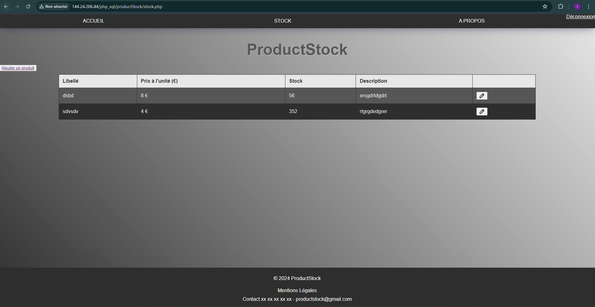
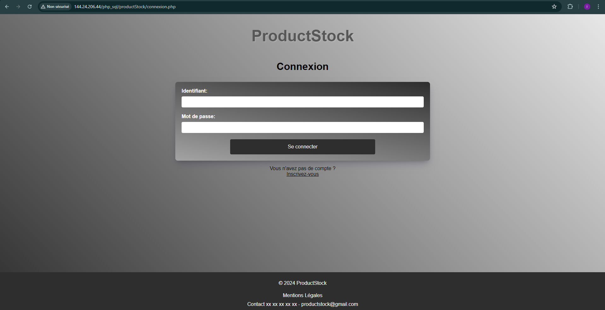

## Guide Complet pour Déployer une Application sur Oracle Cloud

Voici les étapes que j'ai réalisé afin de déployer mon application sur Oracle Cloud

Mon projet est accessible via [144.](http://144.24.206.44/php_sql/productStock/connexion.php)

### Prérequis

- Avoir crée au préalable un compte [Oracle Cloud](https://cloud.oracle.com/)
- avoir une clé SSH

### Étape 1 : Création d'un Compte et Connexion sur Oracle Cloud

- Pour commencer, il est nécessaire de créer un compte et de se connecter sur [Oracle Cloud](https://cloud.oracle.com/).

### Étape 2 : Accès au Tableau de Bord

- Il faut accéder au tableau de bord OCI et navigue jusqu'au menu "Compute" et sélectionnez "Instances".

### Étape 3 : Procédure de Création de l'Instance

1. Démarrer en cliquant sur "Create Instance".
2. Attribuer un nom à l'instance.
3. Choisir la région et la disponibilité souhaitée.

### Étape 4 : Sélection de l'Image du Système d'Exploitation

- Sous "Image and Shape", il faut cliquer sur "Change Image".
- Il faut pter pour "Canonical Ubuntu" et sélectionner une version LTS comme Ubuntu 20.04 LTS.

### Étape 5 : Configuration de la Forme de l'Instance

- Pour configurer la forme de l'instance, il faut cliquer sur "Change Shape" pour sélectionner la forme de l'instance, par exemple VM.Standard.E2.1.Micro pour une utilisation gratuite.

### Étape 6 : Gestion des Clés SSH

- Coller la clé publique SSH au préalable générée dans le champ approprié.

### Étape 7 : Lancement de l'Instance

- Cliquez sur "Create" pour démarrer  l'instance.

---

## Étape 2 : Configuration Initiale de la VM

1. **Connexion à la VM**
   - Utiliser SSH pour vous connecter à l'instance :

     ```bash
     ssh -i /chemin/vers/votre/clé.pem ubuntu@<IP-de-votre-instance>
     ```

2. **Mise à Jour des Paquets**
   - Mettre à jour les paquets de la VM :
     ```bash
     sudo apt update
     sudo apt upgrade -y
     ```

---

## Étape 3 : Installation d'Apache2

1. **Installation d'Apache2**
   - Installer Apache2 :
     ```bash
     sudo apt install apache2 -y
     ```

2. **Démarrage et Activation d'Apache2**
   - Démarrer Apache2 et le configurer pour le démarrage automatique :
     ```bash
     sudo systemctl start apache2
     sudo systemctl enable apache2
     ```

3. **Vérification de l'Installation**
   - Utiliser un navigateur pour accéder à l'adresse IP publique de votre VM et vérifier la page de bienvenue d'Apache2.

---

## Étape 4 : Installation de PHP

1. **Installation de PHP et de ses Modules**
   - Installer PHP ainsi que les modules nécessaires :
     ```bash
     sudo apt install php libapache2-mod-php php-mysql -y
     ```

2. **Redémarrage d'Apache2**
   - Redémarrer Apache2 pour appliquer les configurations PHP :
     ```bash
     sudo systemctl restart apache2
     ```

3. **Vérification de l'Installation de PHP**
   - Créer un fichier `info.php` dans le répertoire `/var/www/html` :
     ```bash
     echo "<?php phpinfo(); ?>" | sudo tee /var/www/html/info.php
     ```
   - Accéder à `http://<IP-de-votre-instance>/info.php` pour vérifier la configuration PHP.

---

## Étape 5 : Installation de MySQL

1. **Installation du Serveur MySQL**
   - Installer le serveur MySQL :
     ```bash
     sudo apt install mysql-server -y
     ```

2. **Sécurisation de MySQL**
   - Exécuter le script de sécurisation :
     ```bash
     sudo mysql_secure_installation
     ```
   - Suivre les instructions pour sécuriser MySQL et définir le mot de passe de l'utilisateur root.

3. **Création d'une Base de Données et d'un Utilisateur**
   - Connectez-vous à MySQL :
     ```bash
     sudo mysql -u root -p
     ```
   - Créez une base de données et un utilisateur :
     ```sql
     CREATE DATABASE nom_de_votre_base_de_donnees;
     CREATE USER 'nom_utilisateur'@'localhost' IDENTIFIED BY 'mot_de_passe';
     GRANT ALL PRIVILEGES ON nom_de_votre_base_de_donnees.* TO 'nom_utilisateur'@'localhost';
     FLUSH PRIVILEGES;
     EXIT;
     ```

     Pour ma part, j'ai crée ma base de données productStock et mon utilisateur irene@localhost.

---

## Étape 6 : Déploiement de l'Application PHP

1. **Transfert des Fichiers de l'Application**
   - Transférer les fichiers PHP vers `/var/www/html` en utilisant SCP ou SFTP.

2. **Configuration des Permissions**
   - S'assurer que les fichiers ont les bonnes permissions :
     ```bash
     sudo chown -R www-data:www-data /var/www/html
     sudo chmod -R 755 /var/www/html
     ```

3. **Configuration d'un Virtual Host (Optionnel)**
   - Créer un fichier de configuration dans `/etc/apache2/sites-available/` :
     ```bash
     sudo nano /etc/apache2/sites-available/votre_site.conf
     ```
   - Ajouter la configuration suivante :
     ```apache
     <VirtualHost *:80>
         ServerAdmin webmaster@localhost
         DocumentRoot /var/www/html/votre_application

         <Directory /var/www/html/votre_application>
             Options Indexes FollowSymLinks
             AllowOverride All
             Require all granted
         </Directory>

         ErrorLog ${APACHE_LOG_DIR}/error.log
         CustomLog ${APACHE_LOG_DIR}/access.log combined
     </VirtualHost>
     ```
   - Activer le site et redémarrer Apache2 :
     ```bash
     sudo a2ensite votre_site.conf
     sudo systemctl reload apache2
     ```

## Étape 7 : Accès à l'Application

- Accéder à l'application en utilisant l'adresse IP publique de la VM.

---

# Configuration des Variables d'Environnement Apache

## Création du Fichier de Configuration

Créer un fichier nommé `env-vars.conf` dans le répertoire `/etc/apache2/conf-available/` avec le contenu suivant :

```apache
SetEnv MY_VAR "MY_VALUE"
```
## Activez le fichier de configuration :

```
sudo a2enconf env-vars
```
### Redémarrez Apache2 pour appliquer les modifications :

```
sudo systemctl restart apache2
```

Au sein d'un fichier PHP, on peut accéder à la variable d'environnement comme suit :

``` php
$myVar = getenv('MY_VAR');
echo $myVar;
```
---

# Configuration des Virtual Hosts Apache

## Étape 1 : Création des Dossiers

Créez les répertoires nécessaires pour les sites :

```bash
sudo mkdir -p /var/www/irene.isitech/html
sudo mkdir -p /var/www/kagnana.isitech/html
```
## Étape 2 : Attribution des Permissions

Attribuez les permissions appropriées aux utilisateurs pour chaque répertoire :

```bash
sudo chown -R $irene:$irene/var/www/irene.isitech/html

```

## Modification des Permissions pour Apache

Modifiez les permissions pour permettre à Apache de lire les fichiers :

```bash
sudo chmod -R 755 /var/www
```

# Étape 3 : Création d'une Page HTML pour irene.isitech

Utilisez `nano` pour créer une page HTML dans le répertoire `/var/www/irene.isitech/html` :

```bash
nano /var/www/irene.isitech/html/index.html
```

```html
<html>
  <head>
    <title>Welcome to irene.isitech!</title>
  </head>
  <body>
    <h1>Success! The irene.isitech server block is working!</h1>
  </body>
</html>
```

# Étape 4 : Création des Fichiers de Configuration pour irene.isitech

### Copiez la configuration par défaut vers irene.isitech.conf

Pour commencer, copiez la configuration par défaut vers `irene.isitech.conf` :

```bash
sudo cp /etc/apache2/sites-available/000-default.conf /etc/apache2/sites-available/irene.isitech.conf
```

### Modification du fichier de configuration irene.isitech.conf

Modifiez le fichier de configuration `irene.isitech.conf` (ou `/etc/apache2/sites-available/your_domain_1.conf`) avec le contenu suivant :

```apache
<VirtualHost *:80>
    ServerAdmin webmaster@localhost
    ServerName irene.isitech
    ServerAlias www.irene.isitech
    DocumentRoot /var/www/irene.isitech/html
    ErrorLog ${APACHE_LOG_DIR}/error.log
    CustomLog ${APACHE_LOG_DIR}/access.log combined
</VirtualHost>
```

# Étape 5 : Activation des Fichiers de Configuration

### Activation du fichier de configuration irene.isitech.conf

Pour activer le fichier de configuration `irene.isitech.conf`, utilisez la commande suivante :

```bash
sudo a2ensite irene.isitech.conf
```
Pour désactiver la configuration par défaut (`000-default.conf`), utilisez la commande suivante :

```bash
sudo a2dissite 000-default.conf
```

# Étape 6 : Vérification de la Configuration

Pour vérifier la syntaxe de votre configuration Apache, utilisez la commande suivante :

```bash
sudo apache2ctl configtest
sudo systemctl restart apache2
```
---

# GIT

Git est un système de contrôle de version puissant qui permet aux développeurs de suivre les modifications apportées à leur code, de collaborer efficacement et de conserver un historique complet des modifications du projet. Ce guide vous présentera les concepts fondamentaux de Git et vous fournira les commandes essentielles pour vous familiariser avec cet outil.

### Initialisation d'un Dépôt

Pour initialiser un nouveau dépôt Git, naviguez dans le répertoire souhaité et exécutez la commande suivante :

```bash
git init

```

Cette commande créera un répertoire caché `.git` dans le répertoire actuel, le transformant ainsi en un dépôt Git.

### Vérification de l'état du Dépôt

Pour obtenir un aperçu de l'état actuel de votre dépôt, utilisez la commande `git status` :

Bash

```
git status

```

Cette commande affichera un résumé des fichiers non suivis, des fichiers modifiés et des modifications préparées pour le prochain commit.

### Les Branches

Les branches sont des lignes de développement indépendantes au sein d'un dépôt Git. La branche principale, souvent nommée `master` ou `main`, sert de ligne de développement principale.

### Création de Commits

Les commits représentent des instantanés de l'état de votre dépôt à un instant donné. Pour créer un commit, ajoutez d'abord les modifications souhaitées à la zone de préparation à l'aide de la commande `git add` :

```
git add . (ou)
git add <fichier>

```

Pour ajouter tous les fichiers modifiés, utilisez :

```
git add *

```

Ou, pour ajouter tous les fichiers du répertoire actuel, utilisez :


```
git add .

```

Une fois les modifications préparées, créez un commit avec un message descriptif en utilisant la commande `git commit` :


```
git commit -m "Message"

```

### Vérification de l'installation de Git

Pour vous assurer que Git est installé sur votre système, utilisez la commande suivante :

```
git --version

```

Si Git n'est pas installé, vous pouvez l'installer en utilisant le gestionnaire de paquets approprié pour votre système d'exploitation.

### Configuration d'un Dépôt Distant

Un dépôt distant sert d'emplacement central pour stocker et partager le code de votre projet. Pour configurer un dépôt distant, utilisez la commande `git remote add` :


```
git remote add origin <url>

```

Remplacez `<url>` par l'URL réelle du dépôt distant.

### Liste des Dépôts Distants

Pour afficher la liste des dépôts distants configurés, utilisez la commande `git remote -v` :

```
git remote -v

```

Cette commande affichera les noms et les URL de tous les dépôts distants associés à votre dépôt local.

### Envoi des Modifications au Dépôt Distant

Pour envoyer vos modifications locales au dépôt distant pour la première fois, utilisez la commande suivante :

```
git push -u origin main

```

Cette commande poussera la branche locale `main` vers le dépôt distant nommé `origin` et établira une connexion amont entre les deux branches.

### Commande Équivalente

La commande `git push -u origin main` est équivalente à la commande suivante :

```
git push --set-upstream origin main

```

Les deux commandes atteignent le même objectif : pousser la branche locale `main` vers le `origin` distant et établir une connexion amont.

### Travail sur votre Dépôt

**Récupération des Modifications du Dépôt Distant:**

Pour récupérer les dernières modifications du dépôt distant et les fusionner dans votre branche locale, utilisez la commande `git pull` :

```
git pull

```

Cette commande récupérera les modifications les plus récentes depuis le `origin` distant et tentera de les fusionner dans votre branche locale actuelle.

**Ajout de Fichiers à la Zone de Préparation:**

Pour ajouter un fichier spécifique à la zone de préparation pour le prochain commit, utilisez la commande `git add` :

```
git add <fichier>

```

**Création de Commits:**

Pour créer un commit avec un message descriptif, utilisez la commande `git commit` :

```
git commit -m "Message"

```

**Envoi des Modifications au Dépôt Distant:**

Pour envoyer vos commits locaux au dépôt distant, utilisez la commande `git push` :

```
git push

```

Cette commande poussera tous les commits non poussés dans votre branche locale actuelle vers le dépôt distant nommé `origin`.

---

# Ma configuration

### mySQL

Une fois la mise en place de mon serveur effectuée, j'ai pu créer ma base de données ainsi que mes tables, et mon utilisateur associé, et lui attribuer les droits nécéssaires pour ma base de données `productStock`.

```sql
     CREATE DATABASE productStock;
     CREATE USER 'irene'@'localhost' IDENTIFIED BY '*****';
     GRANT ALL PRIVILEGES ON productStock.* TO 'irene'@'localhost';
     FLUSH PRIVILEGES;
     EXIT;
```

```sql
    USE productStock;

    CREATE TABLE users (id INT AUTO_INCREMENT PRIMARY KEY, username VARCHAR(255)
    NOT NULL, password VARCHAR(255) NOT NULL, email VARCHAR(255) NOT NULL);

    CREATE TABLE users (id INT AUTO_INCREMENT PRIMARY KEY, name VARCHAR(255)
    NOT NULL, description VARCHAR(255) NOT NULL, stock int NOT NULL, price int
    NOT NULL);
```

### Virtual Host

Ma configuration est un peu praticulière. En effet, nous sommes deux à avoir nos sites sur le meme serveur, alors il a fallu configurer un Virtual Host un peu spécial.

Voici ma configuration:

```apache
<VirtualHost *:80>
    ServerAdmin admin@localhost
    ServerAlias 144.24.206.44
    DocumentRoot /var/www/html
    Alias /php_sql /var/www/html/php_sql
    Alias /Isitech-PHP-MYSQL /var/www/html/Isitech-PHP-MYSQL
    ErrorLog ${APACHE_LOG_DIR}/error.log
    CustomLog ${APACHE_LOG_DIR}/access.log combined
</VirtualHost>
```

Nous avons du faire 2 Aliad avec nos deux sites tous deux présents dans le dossier `/var/www/html`

### Variables d'environnement

J'ai crée un fichier env-vars.conf dans le dossier `/etc/apache2/conf-available` avec les variables propres aux deux sites hébergés sur le serveur selon la création des utilisateurs mySQL:

```bash
SetEnv USER "quentin2"
SetEnv USER2 "irene2"
SetEnv PASSWORD "*****"
SetEnv PASSWORD2 "*****"
```
### Configuration de mon fichier PDO

Dans mon fichier PDO, j'ai récupéré mon `USER2` ainsi que mon `PASSWORD2` et je les ai SET dans les variables respectives afin qu'il aille chercher les valeurs des variables directement dans le serveur pour renforcer la sécurité dans mon fichier `env.php`:

``` php
    $host = 'localhost';
    $db   = 'productStock';
    $user = getenv('USER2') ? getenv('USER2') : "root";
    $pass = getenv('PASSWORD2') ? getenv('PASSWORD2') : "Azerty123";
    $charset = 'utf8mb4';

    $dsn = "mysql:host=$host;dbname=$db;charset=$charset";
    $options = [
        PDO::ATTR_ERRMODE            => PDO::ERRMODE_EXCEPTION,
        PDO::ATTR_DEFAULT_FETCH_MODE => PDO::FETCH_ASSOC,
        PDO::ATTR_EMULATE_PREPARES   => false,
    ];

    try {
        $pdo = new PDO($dsn, $user, $pass, $options);
    } catch (\PDOException $e) {
        throw new \PDOException($e->getMessage(), (int)$e->getCode());
    }
```

Comme on peut le voir, le nom de ma bdd ne changera pas donc je l'ai inscrite en dur dans mon fichier, cependant mon utilisateur et mon mot de passe pourraient être changés à tout moment, donc je les récupère dynamiquement sur mon serveur grace à `getenv()`

### Mon application en production

Voici des screenshots de mon application déployee sur le serveur sur l'URL http://144.24.206.44/php_sql/productStock/inscription.php



