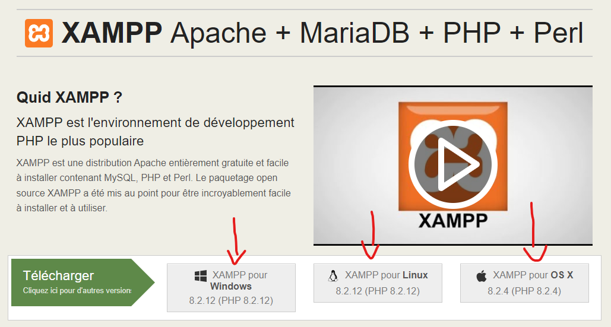
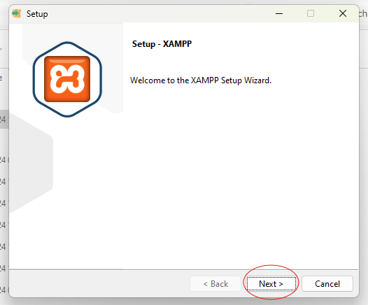
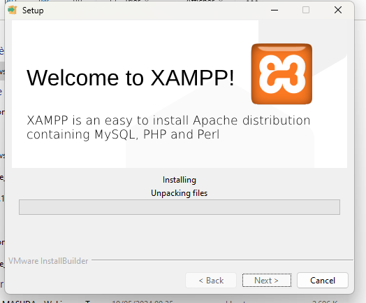

# Description de ProductStock

ProductStock est une application WEB de gestion des stocks de produits. L'application permet la gestion des stocks, la mise a jour de ceux-ci, leur suppression ainsi que l'ajout de nouveaux produits pouur la vente.

L'interface promet également à l'avenir une visualisation en direct des statistiques de vente ainsi que des stocks pour que l'accessibilité des données soient visibles et plus accessible via une interface WEB facile d'utilisation et simple.

# Comment lancer l'application ?

## Prérequis

Pour pouvoir lancer le projet il est nécéssaire de disposer de XAMPP afin d'avoir l'accès à un serveur apache, et mySQL.

Pour installer XAMPP, il suffit de se rendre sur le site officiel:

https://www.apachefriends.org/fr/

Et de télécharger le lien adéquat en fonction de votre OS.

Cliquez ensuite sur le fichier .exe ou sur le telechargement pour démarrer l'installation.

Cette popup devrait s'afficher:

Cliquez sur "Next" jusqu'a ce que l'installation débute:

## Mise en place du projet:

Une fois l'installation de Xampp terminée, nous pouvons passer à la mise en place du projet en local.

Pour ce faire, il faut télécharger le fichier zipp du projet depuis le dépot gitHub

Qu'est ce qu'un vhost? (a expliquer dans le readme md)
