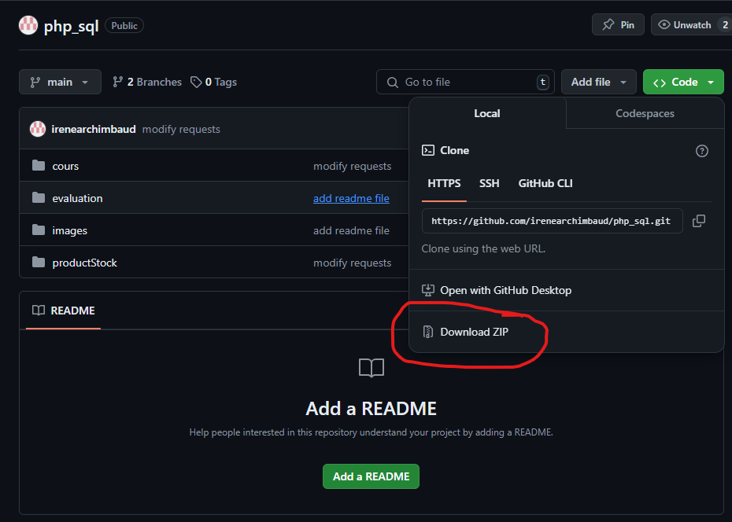
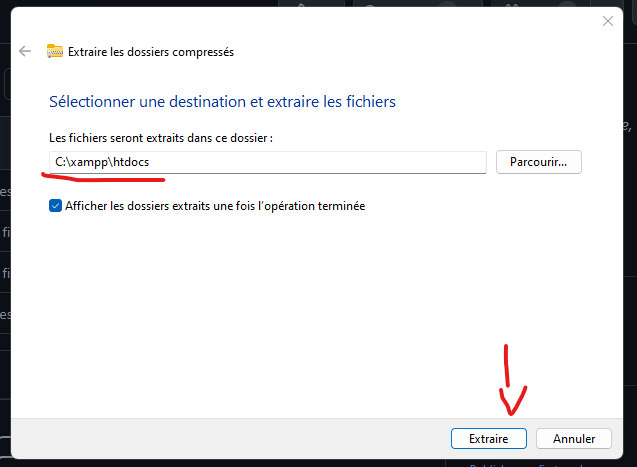
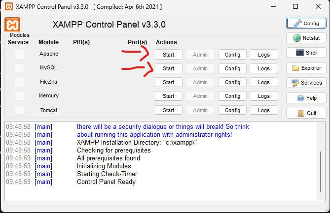
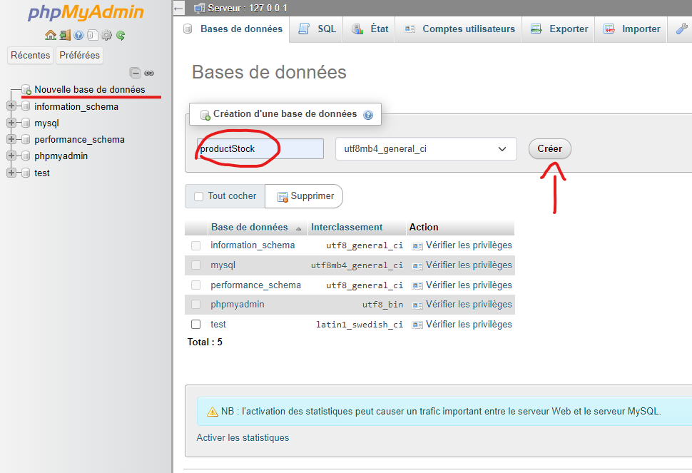
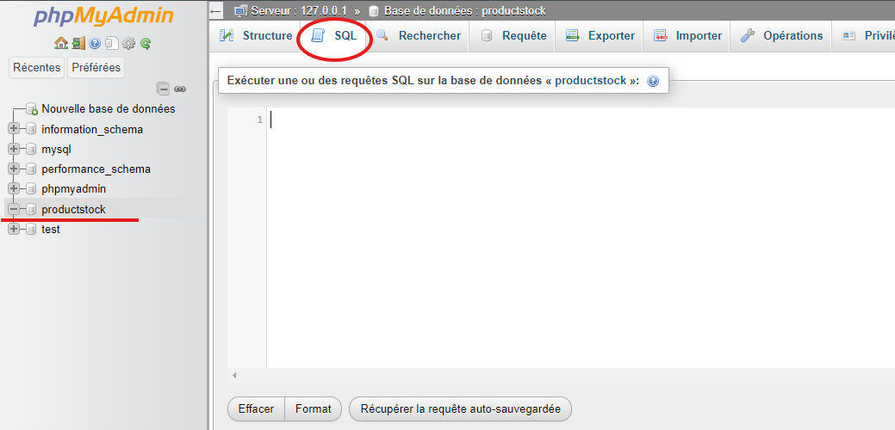
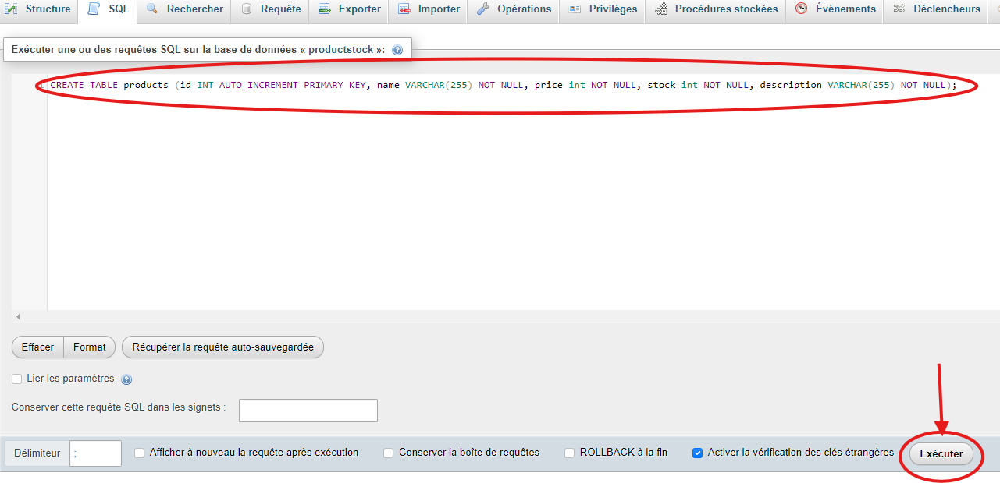

# Description de ProductStock

ProductStock est une application WEB de gestion des stocks de produits. L'application permet la gestion des stocks, la mise a jour de ceux-ci, leur suppression ainsi que l'ajout de nouveaux produits pouur la vente.

L'interface promet également à l'avenir une visualisation en direct des statistiques de vente ainsi que des stocks pour que l'accessibilité des données soient visibles et plus accessible via une interface WEB facile d'utilisation et simple.

# Comment lancer l'application ?

## Prérequis

Pour pouvoir lancer le projet il est nécéssaire de disposer de XAMPP afin d'avoir l'accès à un serveur apache, et mySQL.

Pour installer XAMPP, il suffit de se rendre sur le site officiel:

https://www.apachefriends.org/fr/

Et de télécharger le lien adéquat en fonction de votre OS.


Cliquez ensuite sur le fichier .exe ou sur le telechargement pour démarrer l'installation.

Cette popup devrait s'afficher:


Cliquez sur "Next" jusqu'a ce que l'installation débute:


## Mise en place du projet:

Une fois l'installation de Xampp terminée, nous pouvons passer à la mise en place du projet en local.

Pour ce faire, il faut télécharger le fichier zipp du projet depuis le dépot gitHub



Une fois téléchargé, extrayez le dossier dans `C:\xampp\htdocs`. (Dans le dossier htdocs de xampp)



### Base de données MariaDB

Pour mettre en place la base de données, démarrez Apache et MySQL depuis XAMPP :



Il est maintenant possible d'accéder à PHPMyAdmin pour accéder aux bases de données depuis le navigateur web avec l'adresse [http://localhost/phpmyadmin/](http://localhost/phpmyadmin/)

Pour créer la base de données, cliquez sur "Nouvelle base de données", donnez-lui un nom, dans notre cas `productStock`, puis cliquez sur "Créer".



### Création des tables

Pour que la base de données corresponde aux requêtes effectuées dans le projet, il va falloir créer nos tables dans notre base de données.

Pour ce faire, nous allons cliquer sur la base de données que l'on vient de créer: `productStock`, puis on va se rendre dans l'onglet SQL en haut.



Entrez les requêtes SQL suivantes puis exécutez-les :

```sql
CREATE TABLE users (id INT AUTO_INCREMENT PRIMARY KEY, username VARCHAR(255) NOT NULL, password VARCHAR(255) NOT NULL, email VARCHAR(255) NOT NULL);

CREATE TABLE products (id INT AUTO_INCREMENT PRIMARY KEY, name VARCHAR(255) NOT NULL, price int NOT NULL, stock int NOT NULL, description VARCHAR(255) NOT NULL);
```

